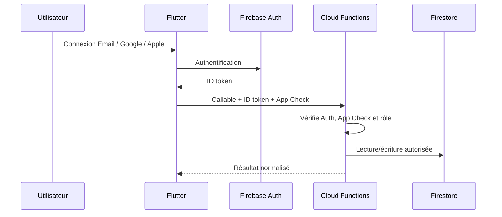
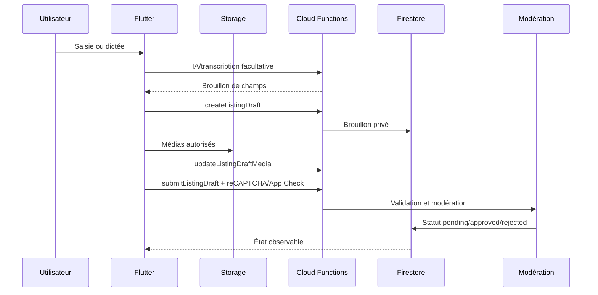
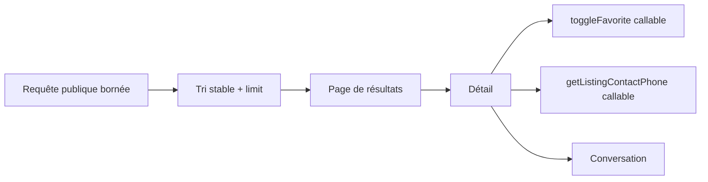
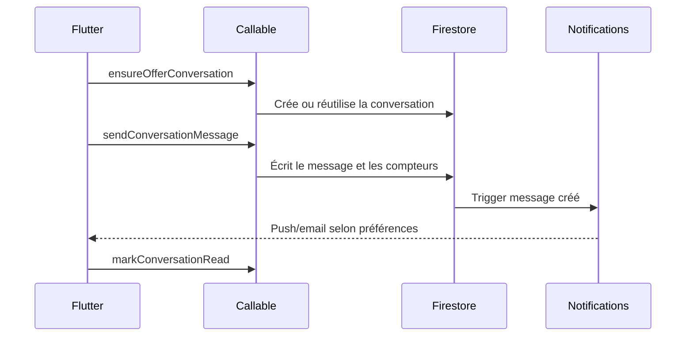
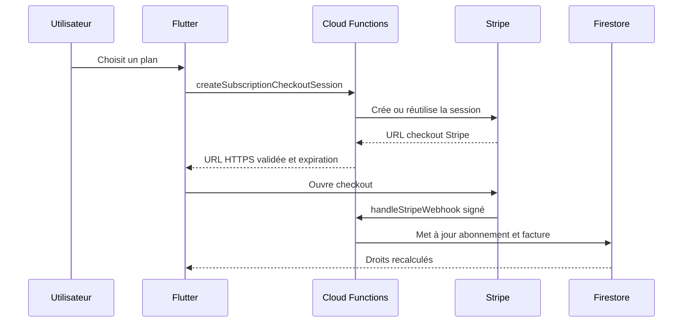
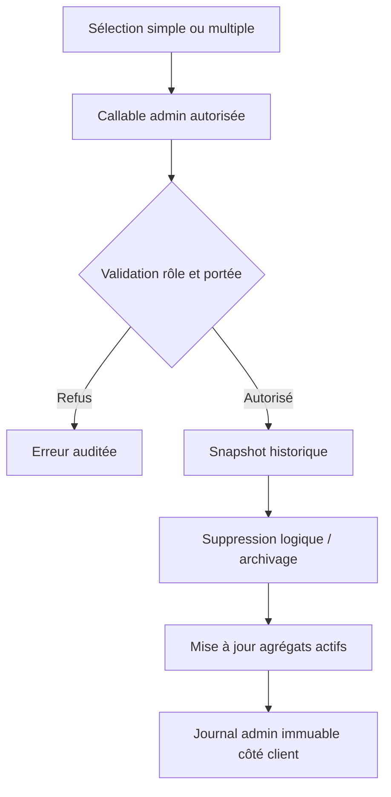

# Flux techniques critiques

## Authentification et App Check

Règles :

- les rôles autoritaires sont les custom claims et les documents backend synchronisés ;
- le client ne peut jamais s’attribuer un rôle, un abonnement ou un droit ;
- les erreurs exposées au client utilisent des codes stables sans détail sensible ;
- la suppression de compte passe par `requestAccountDeletion` et une procédure backend traçable.

## Publication d’une annonce

Garanties : validation backend, quota d’abonnement backend, médias contrôlés, idempotence de soumission, journalisation de la modération et absence de publication directe depuis le client.

## Consultation, favoris et contact

Les listes publiques sont bornées et doivent évoluer vers une pagination par curseur. Le téléphone n’est retourné que par callable lorsque les règles métier l’autorisent.

## Messagerie

Les messages sont écrits côté backend, paginés, associés à une conversation autorisée et soumis aux règles de blocage/modération.

## Abonnement Stripe

Le retour navigateur ne prouve jamais le paiement. Seul un webhook Stripe signé ou une vérification backend met à jour les droits.

## Suppression administrative et historique

Une donnée supprimée disparaît des listes et statistiques actives, mais son résumé, l’auteur de l’action, la date et le motif restent disponibles dans l’historique autorisé.