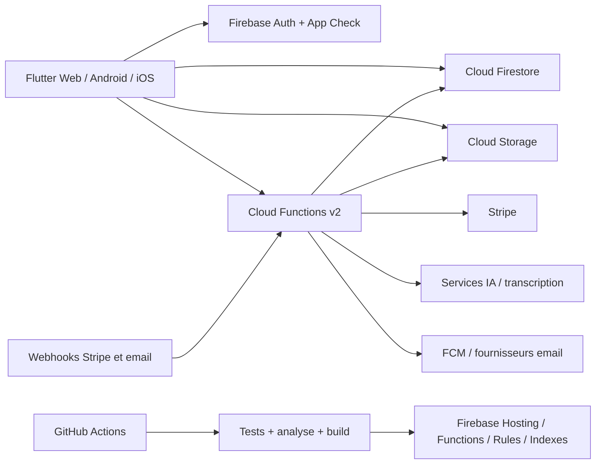

# Architecture technique — vue d’ensemble

## Principes cibles

- Architecture Flutter par fonctionnalité.
- Pages limitées à l’orchestration et widgets de présentation.
- Logique métier indépendante de Flutter et Firebase quand cela apporte un test unitaire utile.
- Repositories comme frontière d’accès aux données.
- Pagination par curseur pour les listes longues.
- Cache avec source de vérité, durée de vie et invalidation documentées.
- Écritures sensibles, paiement et droits exécutés côté backend.
- Suppression logique et journal d’audit pour les données administratives importantes.
- Trois environnements séparés : développement, staging et production.

## Flux critiques à documenter ensuite

- authentification et App Check ;
- publication et modération d’annonce ;
- messagerie et notifications ;
- abonnement Stripe et webhooks ;
- parcours entrepreneur et génération PDF ;
- suppression administrative et historique.
