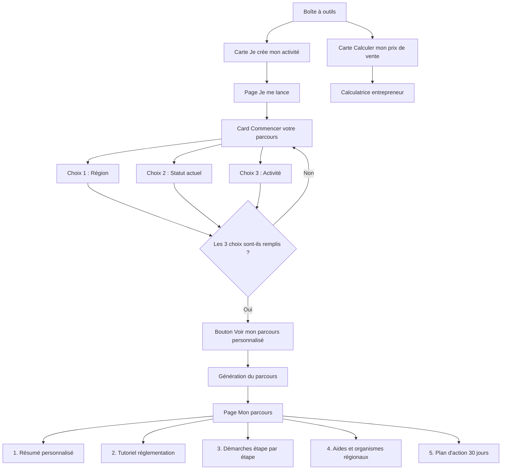

# Flow cible de la boîte à outils

## Objectif principal

Le flow Je me lance doit guider simplement un utilisateur qui veut créer ou structurer son activité.

L'utilisateur commence par renseigner uniquement 3 informations essentielles :

- sa région
- son statut actuel
- son activité

À partir de ces 3 choix, l'application génère un parcours personnalisé qui lui explique :

- la réglementation applicable à son activité
- les points de vigilance selon son statut personnel
- les démarches à réaliser dans le bon ordre
- les aides et organismes utiles dans sa région
- un plan d'action clair, étape par étape

Le flow ne doit pas donner l'impression d'un formulaire complexe. Il doit ressembler à un assistant de démarrage simple, qui accompagne l'utilisateur sans le perdre.

## Principe général du nouveau flow

### Avant

Le flow mélangeait plusieurs intentions :

- créer son entreprise
- calculer un prix
- accéder directement à Mon parcours
- reprendre un ancien parcours
- générer une recommandation complète

Résultat : l'utilisateur ne comprenait pas clairement quoi faire en premier.

### Maintenant

Le flow est simplifié autour d'une logique unique :

Je choisis ma région, mon statut et mon activité. L'application me construit ensuite un tutoriel personnalisé pour me lancer.

## Nouveau parcours utilisateur



## Structure globale de la boîte à outils

La page Boîte à outils conserve deux parcours distincts :

- Je crée mon activité
- Je calcule mon prix de vente

La calculatrice entrepreneur reste indépendante. Elle ne doit pas perturber le flow de création d'activité.

## Page 1 — Boîte à outils

### Rôle de la page

La page Boîte à outils sert uniquement de point d'entrée.

Elle doit proposer clairement deux choix :

- créer son activité
- calculer son prix de vente

L'utilisateur qui veut se lancer doit comprendre immédiatement qu'il doit cliquer sur la carte Je crée mon activité.

### Carte principale — Je crée mon activité

Titre : Je crée mon activité

Sous-titre : Un parcours simple pour comprendre la réglementation, choisir les bonnes démarches et avancer étape par étape.

Contenu court affiché :

- un accompagnement personnalisé selon la région
- des conseils adaptés au statut actuel
- une orientation selon l'activité choisie
- un tutoriel clair des démarches à effectuer
- les aides et contacts utiles

Bouton principal : Commencer mon parcours

Action : ouvre la page Je me lance.

### Carte secondaire — Calculer mon prix de vente

Titre : Calculer mon prix de vente

Sous-titre : Estimez votre tarif en tenant compte de vos charges, de votre temps et de votre marge.

Bouton : Ouvrir la calculatrice

Action : ouvre la calculatrice entrepreneur.

## Page 2 — Je me lance

### Rôle de la page

La page Je me lance est la vraie première étape du parcours.

Elle ne doit pas afficher trop d'informations. Elle doit uniquement demander à l'utilisateur les 3 informations indispensables pour construire son parcours :

- région
- statut actuel
- activité

### Header de la page Je me lance

Titre : Je me lance

Sous-titre : Répondez à 3 questions pour obtenir votre parcours personnalisé.

Progression affichée : une progressbar doit être placée sous le header. Elle représente l'avancement des 3 choix obligatoires.

États possibles :

- 0 / 3 : aucune information renseignée
- 1 / 3 : une information renseignée
- 2 / 3 : deux informations renseignées
- 3 / 3 : parcours prêt à générer

Texte sous la progressbar, exemples :

- 0 / 3 renseigné — Commencez par votre région
- 1 / 3 renseigné — Continuez avec votre statut
- 2 / 3 renseignés — Il reste votre activité
- 3 / 3 renseignés — Votre parcours est prêt

### Card principale — Commencer votre parcours

Cette card est le cœur de la page. Elle doit être visible immédiatement, sans scroll inutile.

Titre : Commencer votre parcours

Sous-titre : Sélectionnez votre région, votre statut actuel et votre activité pour obtenir un guide adapté à votre situation.

### Sélecteur 1 — Région

Label : Votre région

Texte d'aide : Elle permet d'adapter les aides, les contacts et les démarches locales.

Comportement :

- si la région existe déjà dans le profil utilisateur, elle est préremplie
- l'utilisateur peut la modifier
- si aucune région n'est connue, le champ reste vide
- le champ est obligatoire

Placeholder : Choisir ma région

Exemples :

- Guadeloupe
- Martinique
- Guyane
- Réunion
- Mayotte
- Île-de-France
- Occitanie
- Nouvelle-Aquitaine

Règle DROM : si la région sélectionnée est un DROM, le parcours doit afficher des informations adaptées :

- aides territoriales
- dispositifs spécifiques ultramarins
- organismes locaux
- vigilance sur les délais et formalités propres au territoire

### Sélecteur 2 — Statut actuel

Label : Votre statut actuel

Texte d'aide : Il permet d'identifier les règles de cumul, les droits possibles et les points de vigilance.

Placeholder : Choisir mon statut

Exemples de statuts :

- Salarié
- Fonctionnaire / agent public
- Demandeur d'emploi
- Étudiant
- Retraité
- Sans activité
- Déjà entrepreneur
- Autre situation

Comportement : le statut influence le contenu du parcours.

Exemples :

- si l'utilisateur choisit Fonctionnaire / agent public, le parcours doit afficher une alerte sur le cumul d'activité
- si l'utilisateur choisit Demandeur d'emploi, le parcours doit afficher les informations liées aux aides possibles, comme ACRE ou les dispositifs France Travail
- si l'utilisateur choisit Salarié, le parcours doit rappeler les vérifications possibles liées au contrat de travail, à la clause d'exclusivité ou à la non-concurrence

### Sélecteur 3 — Activité

Label : Votre activité

Texte d'aide : Elle permet d'adapter la réglementation, les assurances, les démarches et les obligations.

Placeholder : Choisir mon activité

Exemples d'activités :

- Service à la personne
- Nettoyage
- Jardinage
- Livraison
- Restauration
- BTP / travaux
- Coiffure / esthétique
- Commerce
- Vente en ligne
- Transport
- Formation
- Conseil
- Artisanat
- Réparation
- Événementiel
- Activité digitale
- Autre activité

Comportement : l'activité choisie doit déclencher :

- les réglementations éventuelles
- les assurances recommandées
- les diplômes ou autorisations possibles
- les risques métier
- les démarches particulières

Exemples :

- si l'utilisateur choisit Restauration, le parcours doit faire apparaître l'hygiène alimentaire, les autorisations éventuelles, l'assurance professionnelle et les obligations sanitaires
- si l'utilisateur choisit BTP / travaux, le parcours doit faire apparaître l'assurance décennale si concerné, la responsabilité civile professionnelle, la qualification ou l'expérience, les devis, la facturation et la sécurité chantier

### Bouton principal de validation

Texte du bouton : Voir mon parcours personnalisé

État inactif : le bouton reste désactivé tant que les 3 champs ne sont pas remplis.

Message affiché si incomplet : Complétez votre région, votre statut et votre activité pour générer votre parcours.

État actif : lorsque les 3 champs sont remplis :

- le bouton devient actif
- la progressbar passe à 100 %
- le texte indique que le parcours est prêt

Message affiché : Votre parcours est prêt. Vous pouvez continuer.

Validation : lorsque l'utilisateur clique sur Voir mon parcours personnalisé, l'application doit :

- vérifier que les 3 champs sont remplis
- sauvegarder les choix
- générer les données dérivées
- ouvrir la page Mon parcours

## Page 3 — Mon parcours

### Rôle de la page

La page Mon parcours ne doit pas être seulement une synthèse. Elle doit devenir un véritable tutoriel guidé, organisé dans l'ordre logique des démarches.

L'utilisateur doit comprendre :

- ce qu'il doit savoir
- ce qu'il doit vérifier
- ce qu'il doit faire
- dans quel ordre il doit le faire

### Header de la page Mon parcours

Titre : Mon parcours personnalisé

Sous-titre dynamique, exemple : Créer une activité de jardinage en Guadeloupe avec le statut actuel : salarié.

Actions disponibles :

- Modifier mes réponses
- Recommencer
- Continuer mon plan d'action

### Section 1 — Résumé de ma situation

Objectif : confirmer à l'utilisateur que l'application a bien compris son projet.

Contenu affiché :

- Région : Guadeloupe
- Statut actuel : Salarié
- Activité : Jardinage
- Niveau de vigilance : Moyen
- Parcours recommandé : Création progressive

Texte d'accompagnement : Votre parcours est adapté à votre région, à votre situation actuelle et à votre activité. Suivez les étapes dans l'ordre pour avancer sans oublier les points importants.

### Section 2 — Ce que vous devez savoir avant de commencer

Titre : 1. Comprendre les règles de votre activité

Objectif : présenter les informations réglementaires importantes avant les démarches.

Cette section doit être pédagogique. Elle doit ressembler à un mini-cours clair, pas à une liste technique.

Contenu :

- activité libre ou réglementée
- qualification éventuelle
- assurance recommandée ou obligatoire
- déclarations particulières
- erreurs à éviter

Exemple de structure :

- Bloc 1 — Activité libre ou réglementée
- Bloc 2 — Autorisations ou qualifications
- Bloc 3 — Assurances à prévoir
- Bloc 4 — Points de vigilance

### Section 3 — Les règles liées à votre statut actuel

Titre : 2. Vérifier votre situation personnelle

Objectif : adapter le parcours au statut de l'utilisateur.

Contenu selon le statut :

- Fonctionnaire / agent public : card de vigilance sur le cumul d'activité, autorisation préalable, contact RH et conservation d'une trace écrite
- Salarié : card sur le contrat de travail, clause d'exclusivité, non-concurrence, loyauté et compatibilité horaire
- Demandeur d'emploi : card sur ACRE, ARCE, maintien partiel des allocations, rendez-vous France Travail et calendrier de création

### Section 4 — Statut juridique conseillé

Titre : 3. Choisir le bon cadre pour démarrer

Objectif : donner une orientation simple, sans surcharger l'utilisateur.

Contenu : la page affiche une recommandation principale.

Exemple : Option conseillée pour démarrer : micro-entreprise.

Justification : ce statut peut être adapté pour tester une activité avec des démarches simplifiées, une comptabilité allégée et des charges calculées selon le chiffre d'affaires.

Important : la recommandation doit rester prudente. Elle doit être présentée comme une orientation, pas comme une décision juridique définitive.

Bloc Plan B : si votre activité se développe.

### Section 5 — Les démarches dans le bon ordre

Titre : 4. Faire les démarches étape par étape

Objectif : transformer le parcours en tutoriel concret. Chaque démarche doit être affichée comme une étape simple.

Étapes attendues :

1. Vérifier la réglementation de l'activité
2. Vérifier sa situation personnelle
3. Choisir le statut de lancement
4. Préparer les informations nécessaires
5. Déclarer l'activité
6. Mettre en place les protections utiles
7. Organiser la gestion
8. Trouver les premières aides
9. Lancer les premières offres

Chaque étape doit pouvoir porter un statut :

- À faire
- En cours
- Terminé

### Section 6 — Aides et financements

Titre : 5. Identifier les aides possibles

Objectif : afficher uniquement les aides pertinentes selon :

- région
- statut actuel
- activité
- type de projet

Exemples d'aides possibles :

- ACRE
- ARCE
- maintien partiel des allocations
- prêt d'honneur
- aides régionales
- aides territoriales
- dispositifs DROM
- fonds européens si pertinent
- accompagnement par chambres consulaires
- réseaux d'accompagnement

Affichage recommandé pour chaque aide :

- nom de l'aide
- pour qui
- intérêt
- vigilance
- prochaine action

### Section 7 — Contacts et guichets utiles

Titre : 6. Contacter les bons organismes

Objectif : donner à l'utilisateur les bons interlocuteurs selon son territoire.

Contenu attendu :

- chambre de commerce
- chambre des métiers
- France Travail
- collectivités
- organismes d'accompagnement
- plateformes régionales
- services économiques locaux
- réseaux d'aide à la création

Règle régionale :

- si la région est renseignée, les contacts doivent être adaptés à cette région
- si la région est un DROM, afficher en priorité les contacts locaux et aides territoriales

### Section 8 — Coûts à prévoir

Titre : 7. Prévoir les coûts de lancement

Objectif : aider l'utilisateur à anticiper les frais.

Coûts affichés :

- formalités
- assurance professionnelle
- compte bancaire
- comptable si nécessaire
- matériel
- communication
- outils numériques
- frais spécifiques à l'activité

Pour chaque coût, afficher :

- obligatoire ou recommandé
- estimation basse
- estimation haute
- commentaire simple

### Section 9 — Plan d'action 30 jours

Titre : 8. Votre plan d'action sur 30 jours

Objectif : donner une feuille de route concrète.

Semaine 1 — Comprendre et vérifier :

- vérifier la réglementation
- vérifier les règles liées au statut actuel
- identifier les assurances
- lister les aides possibles
- noter les documents nécessaires

Semaine 2 — Préparer :

- choisir le statut de lancement
- préparer les informations de déclaration
- demander les autorisations si nécessaire
- contacter les organismes utiles
- préparer son offre

Semaine 3 — Déclarer et sécuriser :

- déclarer l'activité
- mettre en place l'assurance
- créer les modèles de devis et facture
- organiser le suivi des charges
- préparer les supports de communication

Semaine 4 — Lancer :

- publier les premières offres
- tester le prix
- contacter les premiers clients
- ajuster l'offre
- suivre les premiers résultats

### Section 10 — Suivi de progression

Objectif : permettre à l'utilisateur d'avancer progressivement.

Chaque étape du parcours doit avoir un statut :

- À faire
- En cours
- Terminé

Progression globale :

- nombre d'étapes terminées
- nombre d'étapes restantes
- pourcentage d'avancement

Exemple : 3 étapes terminées sur 9 — 33 % du parcours réalisé.

## États du parcours

- Brouillon : l'utilisateur a commencé à renseigner ses choix, mais n'a pas encore généré le parcours
- Généré : l'utilisateur a renseigné les 3 choix et le parcours est disponible
- En cours : l'utilisateur a commencé à cocher des étapes
- Terminé : l'utilisateur a terminé toutes les étapes principales

## Persistance Firestore

Le parcours est sauvegardé dans : users/{uid}/parcours/{parcoursId}

### Structure recommandée

```json
{
    "status": "generated",
    "step": "parcours",
    "updatedAt": "timestamp",
    "data": {
        "region": "Guadeloupe",
        "currentStatus": "Salarié",
        "selectedActivity": "Jardinage",
        "projectText": "",
        "territory": {
            "region": "Guadeloupe",
            "departement": "",
            "commune": ""
        }
    },
    "derived": {
        "summary": {},
        "regulationTutorial": [],
        "statusWarnings": [],
        "recommendedLegalStatus": {},
        "steps": [],
        "aides": [],
        "costs": [],
        "contacts": [],
        "plan30": []
    },
    "progress": {
        "completedSteps": [],
        "currentStep": 1,
        "percent": 0
    }
}
```

## Mode local et résilience

Si l'utilisateur n'est pas connecté ou si Firestore est indisponible :

- le flow reste utilisable
- les 3 choix peuvent être renseignés
- le parcours peut être généré localement
- un message informe que la reprise multi-appareils n'est pas garantie

Message utilisateur : Votre parcours est disponible sur cet appareil. Connectez-vous pour le sauvegarder et le retrouver plus tard.

## Règles UX importantes

### Règle 1 — Ne pas ouvrir Mon parcours sans les 3 choix

Le bouton Je me lance ne doit jamais envoyer directement vers un ancien parcours sans contexte clair.

Si un ancien parcours existe, afficher plutôt :

- Continuer mon dernier parcours
- Créer un nouveau parcours

Mais pour un nouvel utilisateur, le flow doit toujours commencer par :

- région
- statut
- activité

### Règle 2 — Une seule action principale par écran

Sur la page Je me lance, l'action principale est : Voir mon parcours personnalisé.

Il ne faut pas afficher plusieurs boutons concurrents.

### Règle 3 — Ne pas surcharger la première étape

La page Je me lance ne doit pas demander :

- le chiffre d'affaires prévu
- la clientèle
- les dépenses
- la TVA
- l'association
- le modèle économique
- l'ambition

Ces éléments peuvent être ajoutés plus tard dans Mon parcours, sous forme de questions complémentaires facultatives.

### Règle 4 — Afficher le résultat comme un tutoriel

La page Mon parcours doit être pensée comme un guide guidé, pas comme un rapport.

Chaque section doit répondre à une question simple :

- Quelle est ma situation ?
- Que dois-je savoir ?
- Quels risques dois-je vérifier ?
- Quel statut peut convenir ?
- Quelles démarches faire ?
- Quelles aides demander ?
- Qui contacter ?
- Combien prévoir ?
- Que faire dans les 30 jours ?

## Mapping technique

Fichiers principaux :

- lib/pages/toolbox_page.dart
- lib/pages/toolbox_hub_page.dart
- lib/pages/toolbox_je_me_lance_page.dart
- lib/app/secondary_named_routes.dart

Rôle attendu :

- lib/pages/toolbox_page.dart : landing page Boîte à outils, cartes principales, entrée vers Je me lance et vers la calculatrice entrepreneur
- lib/pages/toolbox_hub_page.dart : wrapper ou hub secondaire, redirection vers les bons parcours
- lib/pages/toolbox_je_me_lance_page.dart : page Je me lance, card Commencer votre parcours, sélecteurs Région / Statut / Activité, progressbar, validation, génération du parcours, page Mon parcours si elle reste dans ce fichier
- lib/app/secondary_named_routes.dart : routes secondaires liées à la boîte à outils

## Routes recommandées

- /toolbox
- /toolbox/je-me-lance
- /toolbox/mon-parcours
- /toolbox/calculatrice-prix

## Résumé du nouveau flow

1. L'utilisateur ouvre Boîte à outils.
2. Il choisit Je crée mon activité.
3. Il arrive sur Je me lance.
4. Il renseigne uniquement sa région, son statut actuel et son activité.
5. La progressbar indique son avancement.
6. Quand les 3 choix sont remplis, il clique sur Voir mon parcours personnalisé.
7. L'application génère un parcours adapté.
8. La page Mon parcours s'ouvre.
9. L'utilisateur suit un tutoriel structuré : réglementation, statut personnel, statut juridique conseillé, démarches, aides, contacts, coûts et plan 30 jours.

## Tableau de conformité actuelle

Ce tableau compare le flow cible décrit dans ce document avec l'implémentation actuellement en place dans l'application.

| Exigence du flow cible | Statut actuel | Observation |
| --- | --- | --- |
| La landing page Boîte à outils propose 2 parcours distincts | Respecté | La page affiche bien une carte création d'activité et une carte calculatrice. |
| La carte création doit s'appeler Je crée mon activité | Partiel | L'intention est bonne mais le libellé courant reste orienté création d'entreprise et non exactement Je crée mon activité. |
| La CTA principale doit être Commencer mon parcours | Partiel | La CTA actuelle est Démarrer mon projet. Le rôle est conforme, pas le libellé cible. |
| La calculatrice entrepreneur reste indépendante | Respecté | Le deuxième parcours ouvre bien un flow séparé de calcul de prix. |
| La page Je me lance doit être la première vraie étape du parcours | Partiel | Le comportement est conforme, mais le titre d'écran actuel est Mon projet au lieu de Je me lance. |
| La première page ne doit demander que 3 informations | Respecté | L'écran d'entrée impose uniquement région, statut et activité. |
| Région, statut et activité sont obligatoires avant génération | Respecté | La validation dépend bien des 3 champs remplis. |
| Le bouton principal reste désactivé tant que les 3 champs ne sont pas remplis | Respecté | La CTA de validation reste inactive si la saisie est incomplète. |
| Le message d'erreur doit demander de compléter région, statut et activité | Respecté | Le message de validation actuelle rappelle bien ces 3 éléments. |
| La progressbar doit être sur 3 étapes | Non respecté | L'UI courante affiche encore une progression sur 4 étapes avec Étape x sur 4. |
| Le texte sous progressbar doit refléter 0/3, 1/3, 2/3, 3/3 | Non respecté | Les libellés dynamiques demandés par la spec ne sont pas encore implémentés. |
| Le header de la page doit être Je me lance | Non respecté | Le header actuel est Mon projet. |
| La card principale doit être nommée Commencer votre parcours | Partiel | La card joue ce rôle mais son titre actuel est Mon projet. |
| La région doit être préremplie depuis le profil si disponible | Respecté | Le comportement existe déjà. |
| Les DROM doivent déclencher une adaptation du parcours | Respecté | Le code prend déjà en compte les aides et ressources spécifiques DROM. |
| Le statut doit déclencher des vigilances personnalisées | Respecté | Des règles spécifiques existent déjà pour fonctionnaire et demandeur d'emploi. |
| L'activité doit déclencher des obligations et risques métier | Partiel | Une détection de mots-clés et d'activités réglementées existe, mais le tutoriel métier détaillé n'est pas encore structuré comme cible. |
| Le bouton principal doit s'appeler Voir mon parcours personnalisé | Non respecté | Le bouton actuel s'appelle Valider. |
| La validation doit sauvegarder puis ouvrir Mon parcours | Respecté | Le parcours est sauvegardé puis la page de synthèse est ouverte. |
| Mon parcours doit être un tutoriel guidé et non seulement une synthèse | Partiel | La page est déjà riche, mais elle reste encore structurée comme une synthèse enrichie plus que comme un tutoriel pas à pas complet. |
| Mon parcours doit afficher un résumé personnalisé complet | Partiel | Le résumé existe via recommandation, alertes et métriques, mais pas encore sous la forme exacte Région / Statut / Activité / Vigilance / Parcours recommandé. |
| Mon parcours doit inclure un vrai bloc Tutoriel réglementation | Non respecté | Il n'existe pas encore de section pédagogique dédiée et structurée regulationTutorial. |
| Mon parcours doit inclure un bloc distinct sur la situation personnelle | Partiel | Les effets statutaires sont calculés, mais pas encore rendus comme une section autonome bien identifiée. |
| Mon parcours doit inclure un statut juridique conseillé avec avertissement prudent | Respecté | Une recommandation et un plan B existent déjà, avec un ton orientatif. |
| Mon parcours doit afficher les démarches dans le bon ordre sous forme d'étapes | Partiel | Le plan 30 jours existe, mais pas encore comme une suite canonique de 9 démarches avec statuts À faire / En cours / Terminé. |
| Mon parcours doit afficher aides et financements contextualisés | Respecté | Les aides sont filtrées et affichées selon le contexte. |
| Mon parcours doit afficher contacts et guichets régionaux | Respecté | Une section Contacts & guichets par région existe déjà. |
| Mon parcours doit afficher des coûts de lancement détaillés | Respecté | Une section Coûts estimés est déjà en place. |
| Mon parcours doit afficher un plan d'action 30 jours | Respecté | La section correspondante existe déjà et permet le suivi de tâches. |
| Mon parcours doit afficher une progression globale claire | Partiel | L'avancement du plan existe partiellement, mais pas encore sous forme unifiée de progression du parcours entier. |
| Les états Brouillon / Généré / En cours / Terminé doivent être distingués | Partiel | Draft et completed existent, mais generated et in_progress ne sont pas encore modélisés comme dans la spec cible. |
| Firestore doit contenir data, derived et progress structurés selon la nouvelle spec | Partiel | data et derived existent déjà, mais progress et plusieurs sous-structures cibles ne sont pas encore en place. |
| Le mode local doit laisser le flow utilisable | Respecté | Le flow fonctionne déjà en mode local avec message d'information. |
| Il ne faut pas ouvrir directement Mon parcours depuis la landing sans contexte clair | Non respecté | La landing expose encore un bouton Je me lance qui ouvre directement Mon parcours. |
| Une seule action principale doit exister sur la page Je me lance | Respecté | L'écran d'entrée courant n'a plus de compétition de CTA principale. |
| Les questions avancées comme TVA, CA, clientèle, ambition doivent être retirées du premier écran | Respecté | Elles ne sont plus présentes sur l'écran d'entrée actuel. |

## Lecture rapide

### Déjà respecté

- la séparation création d'activité / calculatrice
- les 3 champs obligatoires au départ
- la validation bloquée tant que le formulaire est incomplet
- la persistance du parcours
- les aides, coûts, contacts et plan 30 jours
- le mode local

### Partiellement respecté

- les libellés UX de la landing et de Je me lance
- la structure tutorielle de Mon parcours
- la modélisation détaillée des statuts et de la progression
- la transformation des règles métier en blocs pédagogiques dédiés

### À corriger en priorité

- supprimer l'accès direct ambigu à Mon parcours depuis la landing
- renommer Mon projet en Je me lance
- remplacer la progression 4 étapes par une vraie progression 3/3
- renommer la CTA Valider en Voir mon parcours personnalisé
- restructurer Mon parcours en tutoriel ordonné plutôt qu'en synthèse enrichie

## Plan d'action priorisé

Ce plan transforme les écarts identifiés en séquence d'implémentation concrète.

## Priorité 1 — Corriger l'entrée dans le flow

### Objectif

Supprimer toute ambiguïté dès la landing page Boîte à outils.

### À faire

- remplacer le libellé de la carte principale par Je crée mon activité
- remplacer la CTA Démarrer mon projet par Commencer mon parcours
- supprimer le bouton secondaire qui ouvre directement Mon parcours depuis la landing
- s'assurer que la carte création ouvre toujours Je me lance

### Résultat attendu

L'utilisateur comprend immédiatement qu'il doit commencer par Je crée mon activité puis passer par Je me lance.

### Impact code

- [lib/pages/toolbox_page.dart](/workspaces/presto_app/lib/pages/toolbox_page.dart)
- éventuellement [lib/pages/toolbox_hub_page.dart](/workspaces/presto_app/lib/pages/toolbox_hub_page.dart)

## Priorité 2 — Aligner l'écran Je me lance avec la spec UX

### Objectif

Faire correspondre l'écran actuel Mon projet à la page cible Je me lance.

### À faire

- renommer le header Mon projet en Je me lance
- renommer le titre de la card principale en Commencer votre parcours
- remplacer la logique de progression 4 étapes par une vraie progression 3/3
- afficher un texte dynamique cohérent sous la progressbar
- renommer la CTA Valider en Voir mon parcours personnalisé
- conserver une seule action principale sur l'écran

### Résultat attendu

La page ressemble à un assistant de démarrage simple, centré sur les 3 choix obligatoires.

### Impact code

- [lib/pages/toolbox_je_me_lance_page.dart](/workspaces/presto_app/lib/pages/toolbox_je_me_lance_page.dart)

## Priorité 3 — Stabiliser le modèle de génération du parcours

### Objectif

Préparer une structure de données capable d'alimenter un vrai tutoriel, pas seulement une synthèse.

### À faire

- conserver les 3 entrées obligatoires comme base de génération
- introduire dans derived des blocs plus explicites : summary, regulationTutorial, statusWarnings, recommendedLegalStatus, steps, contacts, progress
- distinguer plus proprement les états draft, generated, in_progress, completed
- définir une structure de progression globale du parcours

### Résultat attendu

Les données ne sont plus seulement calculées pour afficher un résumé, mais pour rendre un tutoriel structuré.

### Impact code

- [lib/pages/toolbox_je_me_lance_page.dart](/workspaces/presto_app/lib/pages/toolbox_je_me_lance_page.dart)
- persistance Firestore sous users/{uid}/parcours/{parcoursId}

## Priorité 4 — Transformer Mon parcours en tutoriel guidé

### Objectif

Faire évoluer la page Mon parcours d'une synthèse enrichie vers un guide pas à pas.

### À faire

- ajouter un vrai bloc Résumé de ma situation
- ajouter un bloc Comprendre les règles de votre activité
- ajouter un bloc Vérifier votre situation personnelle
- garder la recommandation de statut juridique mais l'encadrer comme orientation
- remplacer la simple logique de plan par des démarches ordonnées et statutables
- conserver les sections Aides, Contacts, Coûts et Plan 30 jours, mais les repositionner dans un ordre plus tutoriel

### Résultat attendu

L'utilisateur lit Mon parcours comme un chemin d'exécution clair, et non comme un rapport analytique.

### Impact code

- [lib/pages/toolbox_je_me_lance_page.dart](/workspaces/presto_app/lib/pages/toolbox_je_me_lance_page.dart)

## Priorité 5 — Renforcer la personnalisation métier et territoriale

### Objectif

Mieux adapter le contenu aux DROM, aux statuts personnels et aux activités réglementées.

### À faire

- enrichir les règles spécifiques DROM
- rendre les cartes de vigilance par statut plus explicites
- enrichir les blocs réglementation par activité
- prioriser les organismes régionaux réellement utiles selon territoire

### Résultat attendu

Le parcours paraît réellement personnalisé selon la région, le statut et l'activité.

### Impact code

- [lib/pages/toolbox_je_me_lance_page.dart](/workspaces/presto_app/lib/pages/toolbox_je_me_lance_page.dart)
- [lib/data/je_me_lance_region_contacts.dart](/workspaces/presto_app/lib/data/je_me_lance_region_contacts.dart)

## Priorité 6 — Finaliser la progression et la reprise utilisateur

### Objectif

Permettre un suivi clair d'avancement et une reprise propre du parcours.

### À faire

- afficher une progression globale du parcours
- stocker les étapes terminées, en cours et restantes
- distinguer clairement reprendre un parcours et en créer un nouveau
- améliorer les messages de mode local et de synchronisation

### Résultat attendu

L'utilisateur sait où il en est, peut reprendre son parcours et comprend ce qui est sauvegardé.

### Impact code

- [lib/pages/toolbox_je_me_lance_page.dart](/workspaces/presto_app/lib/pages/toolbox_je_me_lance_page.dart)

## Ordre recommandé d'exécution

1. Corriger la landing page Boîte à outils.
2. Aligner la page Je me lance sur la spec UX.
3. Restructurer le modèle derived et les états de parcours.
4. Recomposer Mon parcours en tutoriel guidé.
5. Renforcer les règles métier, statutaires et territoriales.
6. Finaliser la progression globale et la reprise utilisateur.

## Définition de terminé

Le flow pourra être considéré comme aligné avec cette spec quand :

- la landing n'ouvre plus Mon parcours directement sans contexte
- Je me lance affiche bien une logique 3/3 claire
- Voir mon parcours personnalisé est la seule action principale du premier écran
- Mon parcours expose un tutoriel ordonné par questions et étapes
- les données Firestore portent la progression et les blocs dérivés attendus
- l'utilisateur peut reprendre ou recommencer sans ambiguïté
